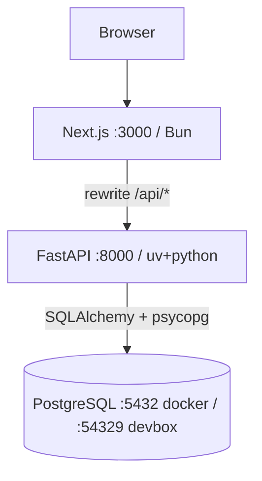

# Repository Guidelines

## Project Overview
InventoryMGR is a full-stack virtual-machine inventory manager: an admin console for cataloging VMs (identity, location, configuration, operations, metadata), with CSV import/upsert, role-based access (admin/editor/viewer), and admin-managed dropdown options. Scope is inventory only — no live virtualization-provider connections, syncs, or credential storage.

## Architecture & Data Flow
A Next.js frontend talks to a FastAPI backend over a same-origin `/api/*` proxy; FastAPI persists to PostgreSQL via SQLAlchemy.

Request flow (state-changing call):
1. UI component (e.g. `frontend/src/routes/VmFormPage.tsx`) calls `api.<method>` in `frontend/src/api/client.ts`.
2. `apiRequest` reads the `inventorymgr_csrf` cookie, sends it as the `X-CSRF-Token` header, and fetches with `credentials: 'include'` (sends the HTTP-only `inventorymgr_session` JWT cookie). Next.js rewrites `/api/*` → backend (`frontend/next.config.mjs`).
3. `backend/app/api/deps.py` guards: `get_current_user` decodes the JWT; `ViewerUser`/`EditorUser`/`AdminUser` enforce role; `require_csrf` matches the header to the JWT `csrf` claim.
4. Route (`backend/app/api/routes/*`) validates the body with a Pydantic schema (`backend/app/schemas/*`) and delegates to a service (`backend/app/services/*`).
5. Service runs SQLAlchemy queries/transactions against models in `backend/app/db/models.py`; the response is serialized by Pydantic and cached client-side by TanStack Query.

## Key Directories
- `backend/app/` — FastAPI app: `main.py` (ASGI entry, CORS, router mount), `api/routes/` (auth, vms, settings, imports), `api/deps.py` (DI/auth/CSRF), `services/` (business logic), `db/models.py`, `schemas/` (Pydantic).
- `backend/tests/` — pytest suites + `conftest.py` fixtures.
- `backend/alembic/` — DB migrations (`alembic.ini`, `env.py`, `versions/`).
- `frontend/src/app/` — App Router: `layout.tsx` (fonts/theme/globals), `providers.tsx` (QueryClient + Theme), `(app)/layout.tsx` (auth gate), route folders.
- `frontend/src/routes/` — page components (Inventory, VmDetail, VmForm, ImportCsv, Settings, Users, Login).
- `frontend/src/components/` — `Layout.tsx`, `AppNav.tsx`, `ui.tsx` (design-system primitives + shared class tokens), `AuthContext.tsx`, `ThemeProvider.tsx`.
- `frontend/src/api/client.ts` — typed API client. `frontend/src/lib/` — `vmForm.ts` (Zod schema/transforms), `classNames.ts`.
- `frontend/e2e/` — Playwright specs. `frontend/src/test/` — Vitest unit tests.
- `graphify-out/` — AST knowledge-graph artifacts (`graph.json`, `GRAPH_REPORT.md`); query with `graphify query "<q>"`, refresh with `graphify update .`.

## Development Commands
Canonical entry is the `justfile` (wrap with `devbox run` when outside the devbox shell, e.g. `devbox run just verify`).
- Setup (deps + DB init + migrations): `just setup`
- Start DB: `just db-up`
- Backend dev: `just api-dev` → `cd backend && uv run uvicorn app.main:app --host 127.0.0.1 --port 8000 --reload`
- Frontend dev: `just web-dev` → `cd frontend && bun run dev`
- Migrations: `cd backend && uv run alembic upgrade head` (new: `uv run alembic revision --autogenerate -m "msg"`)
- Lint/typecheck (frontend): `cd frontend && bun run lint` · `bun run typecheck`
- Full gate (lint + typecheck + tests, both stacks): `just verify`
- Docker (full stack): `export APP_UID=$(id -u) APP_GID=$(id -g) && docker compose up -d --build` (services: db 5432, backend 8000, frontend 3000)
- Prod process mgmt (PM2): `just pm2-start` / `pm2-stop` / `pm2-status` (config in `ecosystem.config.js`)

## Code Conventions & Common Patterns
- **Backend**: `snake_case` functions/vars, `PascalCase` models/schemas, explicit type hints. Layering is strict: route → service → model; keep DB logic in `services/`, never in routes. Errors via `raise HTTPException(status_code, detail)`. Route handlers are sync (FastAPI threadpool over the sync SQLAlchemy engine).
- **Frontend**: `PascalCase` components, `camelCase` vars/hooks. Server state is TanStack Query only (defaults in `providers.tsx`: `staleTime` 30s, retries off) — no ad-hoc fetch state. Errors use the `ApiError` class + `detailMessage(error)` helper (handles FastAPI string and array-of-field detail).
- **Forms**: Zod `vmFormSchema` in `lib/vmForm.ts`; transforms include GB→MB (`×1024`) and semicolon-string↔array via `splitList`. Validate on submit with `safeParse`, map errors with `collectErrors`, then scroll/focus the first invalid field by element id.
- **Auth/RBAC**: CSRF double-submit cookie (read `inventorymgr_csrf` → `X-CSRF-Token`) in `api/client.ts`; server validates in `deps.py`. Client-side gating via `useCurrentUser()` and `<RoleGate allowed={[...]}>` (`AuthContext.tsx`).
- **Styling**: Tailwind v4 with `@theme` tokens in `frontend/src/app/globals.css`; reuse shared class constants from `components/ui.tsx` (`primaryButtonClass`, `cardClass`, `tableWrapClass`, etc.) instead of duplicating utility strings. Fluid layout: `main` fills width with responsive gutters; per-page `max-w-*` wrappers keep forms readable; headings use `--text-fluid-*` clamp tokens.

## Important Files
- Backend entry: `backend/app/main.py`; auth/CSRF/DI: `backend/app/api/deps.py`, `routes/auth.py`.
- Frontend entry: `frontend/src/app/layout.tsx` + `providers.tsx`; app shell: `components/Layout.tsx` + `AppNav.tsx`; design system: `components/ui.tsx`.
- API contract: `frontend/src/api/client.ts` ↔ `backend/app/schemas/*` + `backend/app/api/routes/*`.
- Config: `docker-compose.yml`, `backend/Dockerfile`, `frontend/Dockerfile`, `frontend/next.config.mjs` (`/api/*` rewrite), `frontend/tailwind.config.js`, `backend/pyproject.toml` (ruff/mypy/pytest), `backend/alembic.ini`, `.env.example`, `justfile`, `devbox.json`.

## Runtime/Tooling Preferences
- **Frontend**: **Bun** is the package manager and runtime (`bun.lock`, `oven/bun` image, `bun install --frozen-lockfile`, `bun run <script>`). Do not introduce npm/yarn/pnpm lockfiles. Node 22 only as a devbox fallback.
- **Backend**: **Python 3.12** with **uv** (`uv sync --frozen`, `uv run <cmd>`); deps/tooling in `pyproject.toml`. Do not use bare `pip`/`venv`.
- **Dev env**: **Devbox/Nix** provisions `python@3.12`, `nodejs@22`, `bun`, `postgresql_16`, `uv`, `just`; local Postgres runs on port `54329` (data in `.devbox/postgres`). Prefer `devbox run …` / `just …` so versions stay reproducible.
- **Prod**: PM2 via `ecosystem.config.js` (backend on uv/uvicorn, frontend on `bun run start`).

## Testing & QA
- **Backend (pytest)**: `just api-test` → `cd backend && APP_ENV=test DATABASE_URL="$TEST_DATABASE_URL" uv run pytest`. `conftest.py` drops/recreates the schema per run against `inventorymgr_test` (port 54329) and provides auth/seed helpers. Suites: `test_auth_rbac_vms.py`, `test_csv_imports.py`, `test_settings.py`.
- **Frontend unit (Vitest + jsdom + Testing Library)**: `just web-test` → `cd frontend && bun run test`. Files in `frontend/src/test/*.test.ts(x)` (`vmFormSchema`, `clientBehavior`, `loginSetup`); setup in `src/test/setup.ts`.
- **E2E (Playwright 1.60, chromium, 1 worker / not parallel)**:
  - Local (auto-starts dev servers): `just e2e` → `cd frontend && bunx playwright test` (`playwright.config.ts`).
  - Against a running Docker/prod stack: `cd frontend && ./node_modules/.bin/playwright test --config=playwright.docker.config.ts` with `BASE_URL=http://localhost:3000`. On hosts lacking browser libs, run inside the Playwright container over `--network host` with `PLAYWRIGHT_BROWSERS_PATH=/ms-playwright`.
  - Specs (`frontend/e2e/`): `inventory.spec.ts`, `ui-changes.spec.ts`. They self-seed the first admin (setup flow) and reuse a `loginAsAdmin` helper, so E2E needs a **fresh DB** (`docker compose down -v && up -d --build`).
- Run the full gate with `just verify` before yielding.
